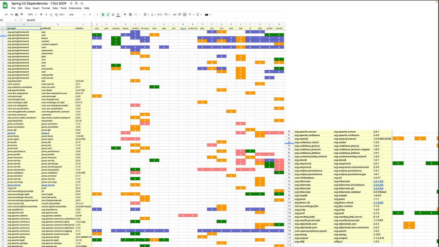

### Opinionated 란 ? 
- 자기 의견을 가지고 있다 + 독단적인 뜻을 가지고 있다.

### Boot 는 우리게에 
- 너가 고민을 많이 하고 프로젝트를 시작할텐데
- 고민 하지마 ! 내가 다 정해줄게 일단 개발만 해 ! 고객에게 가치를 주는 도메인에 만 충실하렴!

### 스프링 프레임워크의 설계 철학
- 극단적인 유연함 추구
- 다양한 관점을 수용
- Not opinionated
- 수많은 선택지를 다 포용
- 그러나 
  - 스프링을 선택하는 고민은 개발자의 몫
  - 잘 못하면 불편한 상황 (호환)
  - 등등등 ...

### 스프링 부트의 설계 철학
- Opinionated - 자기 주장이 강한, 자기 의견을 고집하는, 독선적인
- 일단 정해주는 대로 빠르게 개발하고 고민은 나중에
- 스프링을 잘 활용하는 뛰어난 방법을 제공

### 사용 기술과 의존 라이브러리 결정
- 업계에서 검증된 스프링 생태계 프로젝트, 표준 자바 기술, 오픈소스 기술의 종류와 의존관계, 사용 버전을 정해줌
- 각 기술을 스프링에 적용하는 방식과(DI 구성) 디폴트 설정값 제공

### 스프링 프레임 워크를 사용했을때 따져봐야 했을 기술들

'- by tobi 님 께서 작성하신 부분'

### 사용 기술과 의존 라이브러리 결정
- 업계에서 검증된 스프링 생태계 프로젝트, 표준 자바 기술, 오픈소스 기술의 종류와 의존관계, 사용 버전을 정해줌
- 각 기술을 스프링에 적용하는 방식 ( DI 구성 ) 과 디폴트 설정값 제공

### 결론 
- 스프링 부트가 개발이외 신경써야 되는것들을 커버 해준 덕에 개발자가 비즈니스 로직에만 집중할수 있게 되었다.