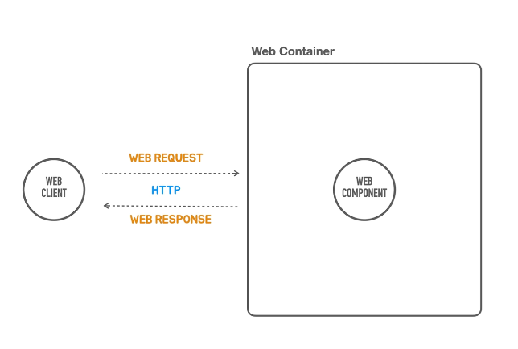

### HTTP 요청과 응답

- web application 이 어떻게 동작하는지 ?
- 동작하는 구조
- web client 가 web 요청을 web Container 에 보내면, 
web Container 는 요청을 처리할 web component 를 찾아서 요청을 위임하고
web component 는 요청을 분석해서 작업을 수행하고 결과를 만들어 낸다.
만들어낸 결과를 web client 에게 return 이 된다.
- 이때 중요한건 web Client 와 web Container 사이에 요청과 응답이 쌍을 맺어서 수행이 된다는것이다.

### web 요청은 어떤식으로 보내야 되고 응답은 어떻게 받아야 되는가 
- 이거를 정의해 놓은 기술이 있는데 이것이 HTTP 라고 부른다.
- protocol 이다. 요청과 응답 둘사이에 소통을 어떻게 할건지를 명시해 놓은것.

### HTTP 
- 웹 Request 와 Response 의 기본 구조를 이해하고 내용을 확인 할 수 있어야 한다.

### Request 
- 웹 Request 와 Response 의 기본 구조를 이해하고 내용을 확인할 수 있어야 한다.
  - Request Line: Method, Path, HTTP Version
  - Headers
  - Message Body
- Response
  - Status Line: HTTP Version, Status Code, Status Text
  - Headers
  - Message Body

### 요청과 응답은 구조가 굉장히 비슷하다.
- 첫줄 에 굉장히 중요한 정보가 담겨져 있고, 이어서 헤더 들이 나오고, 그다음에 Body 가 나온다.

### 요청 !
- 요청의 첫줄에는 어떤 메소드를 이용하겠다 ! -> 그 뒤를 이어서 경로 부분이 나오고 -> HTTP 버전이 나온다.
- Header 에는 굉장히 중요한 정보가 들어가게 된다.
  - Header 에 무엇이 들어가 있는지에 따라서 요청의 처리 방식이 달라지거나, 응답을 생성할때 타입들이 바뀌기도 한다.
  - 그래서 Header 를 필요한 경우엔 확인할 수 있어야 한다.
- Post 나, Put 같이 메세지 바디가 동반이 되는 요청의 경우,
  - Header 의 설정된 Content Type 에 맞는 메세지 Body 가 제일 마지막 부분에 등장한다.

### 응답 ! 
- 첫줄엔 제일 중요한 상태 코드값이다. 상태 코드값에 따른 text 가 뒤에 붙기도 한다.
- 서버에서 만들어 지는 응답에도 Header 가 붙는다.
  - Header 에서 제일 중요한 부분은 메세지 Body 가 어떤 Contents Type 으로 작성이 되어있는가(필수)
  - 서버에서 보내주고싶은 정보들이 Header 에 붙어있다.
  - 그리고 마지막으로 ContentType 의 Body 가 붙는다.
  
