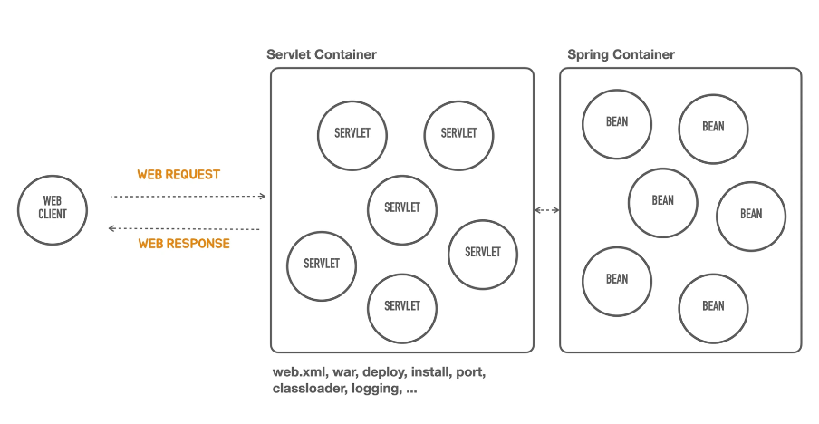
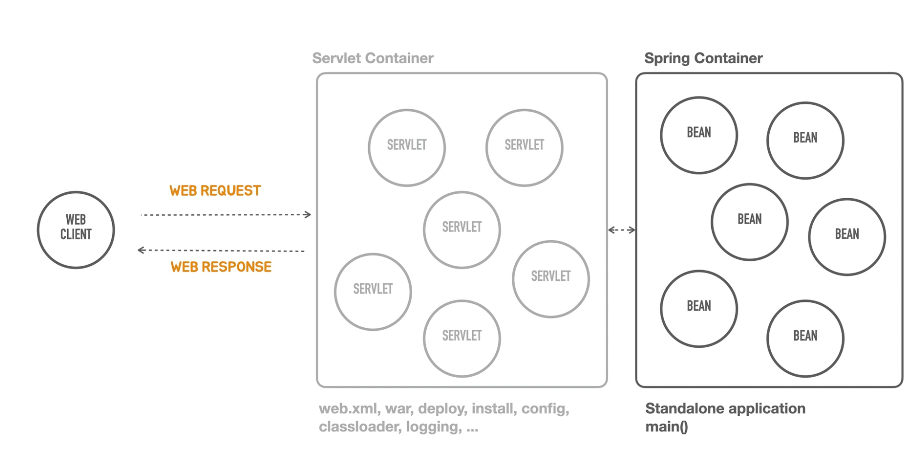

### ContainerLess 개발 준비


- ContainerLess 를 지향한다 라는것은
- 서블릿 컨테이너와 관련된 번거롭고 복잡한 작업들 , 그리고 그걸 하기위한 지식 ... 이런것들을 개발자들이 더이상 신경 쓰지 않고,


- 위 그림 처럼 스프링 컨테이너에 올라가는 Bean 에만 집중하는 것이다.
 
### Hello 는 어떻게 동작했었지... ?

```java
/**
 * Hello Controller 는 "/hello" 라는 경로로 들어오는 요청을 받아서
 * Parameter name 이라는 값을 가지고 hello 뒤에 이름을 붙여서 return 하는 방식이다.
 * @RestController 로 등록을 해놨기 때문에, 웹 응답이 만들어 질때 Controller method 에 return Type 이
 * String 인것을 보고 ContentType 을 자동으로 결정지어 준다.
 * String 이 return 되는 경우에는, text/play type 의 contentType 이 만들어지고,
 * return 한 문자열이 그대로 응답의 body 에 보여지게 되는것이다.
 * 여기까지가 spring 개발의 가이드를 따라서 요청과 응답 을 구현한 내용이다. 
 */
@RestController
public class HelloController {

    @GetMapping("/hello")
    public String hello(String name) {
        return "hello " + name;
    }
}

```

### 메인도 별거 없다
```java
@SpringBootApplication
public class HellobootApplication {

    public static void main(String[] args) {
        SpringApplication.run(HellobootApplication.class, args);
    }

}
```
- 중요한것은 톰캣을 설치하고, 배포하기 위해 빌드 스크립트를 만들거나 한적이 없다는것 !
- 그냥 단지 Springboot 가 처음 만들어준 main method 를 실행하기만 했을뿐,
- servlet Container 가 동작을 하고, 스프링과 관련된 어떠한 설정을 하지 않았는데 Spring Container 도 떴다.
- Controller 로 만들어놓은 코드도 스프링 위에 올라갔기 때문에, 컨트롤러의 기능을 동작 할 수 있었다.

### 그럼 SpringBoot 의 도움을 받지 않고 동작하는 코드로 포팅을 해보도록 해보자
