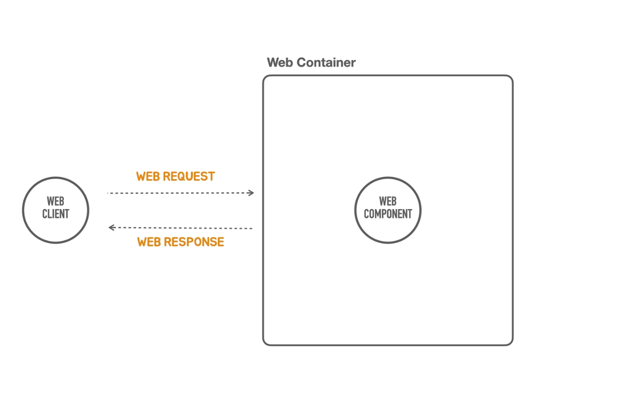
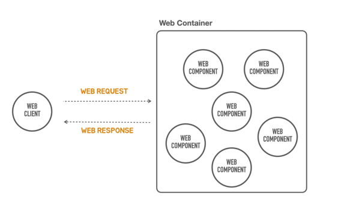
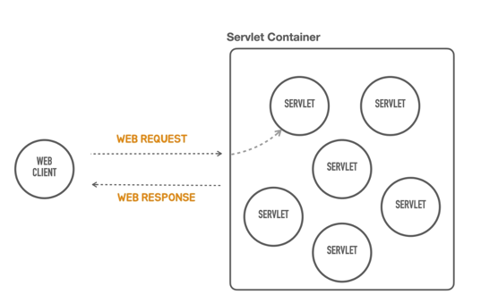
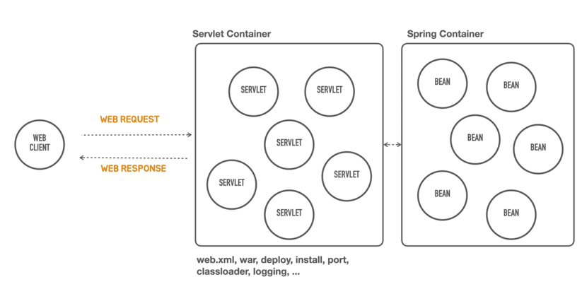
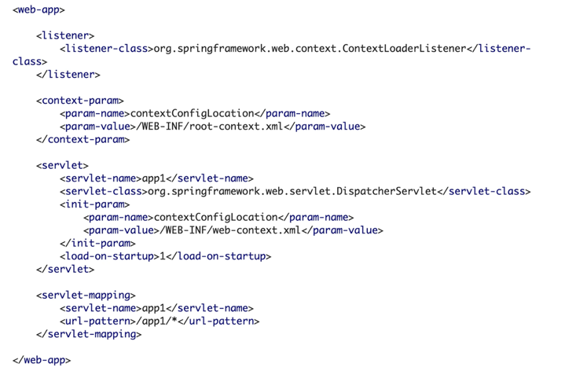
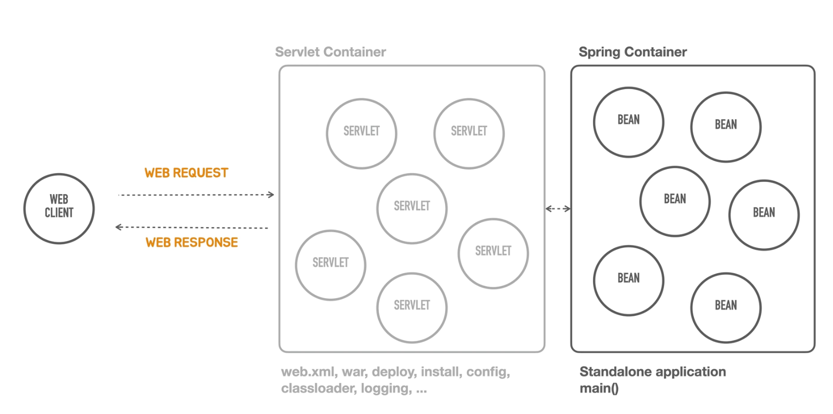

### 컨테이너 리스 란 뭘까
- 컨테이너 쓰지 말고 개발하는걸 말할까 ?
- 컨테이너는 뭘 말하는거지 ? 

### Serverless 와 유사하다.
- server 의 설치 관리, 를 개발자 들이 신경 쓰지 않고, 서버 애플리케이션을 개발하고 배포에만 집중하자 ! 라는것
- 이게 container less 와 유사하다.

### Container 가 뭘까 ? 
- 스프링 컨테이너 ? ioc Container ? 

### WebComponent
- 웹 프로그램을 개발한다는것은 서버에서 동작하면서 기능을 제공해주는 여러가지 컴포넌트를 만드는것
- 회원 가입 기능을 담당하는 web component 를 만들었다는 가정을 해보자
  - 혼자서는 작동을 못한다
  - Web client 가 존재하고 -> web Request 를 보내고 -> web Component 에게 rq 를 보내고 동적인 컨텐츠를 만들어서 web client 에게 응답을 보낸다.
  - 웹은 항상 요청과 응답 이라는것 이 둘 쌍으로 돌아가게 되어있고, 그 요청을 처리하는 하나 이상의 web component 가 존재하고,
  - web component 가 하는 주요한 일은 dynamic content 를 만드는 일이다.
- web component 는 혼자서 존재 할 수 없다. -> web container 안에 들어가 있어야 한다.

### web Container ( 웹컨테이너 ) 란 무었이고 해줘야 하는 일은 무었일까 ? 
- web component 를 관리하는 ( 컨포넌트를 메모리에 올리고, 인스턴스를 만들고 서비스가 되는 중에 라이프사이클을 관리해주는 것)
- web component 는 일반적으로 하나의 web component 만 관리하지 않고 여러 컴포넌트를 관리한다. (여러 기능이라 하면, 주문, 회원가입, 등등등)

### 추가로 web Container 가 해줘야 하는 중요한것 
- 클라이언트 로 부터 들어오는 요청을 정해진 룰에 따라서 어느 component 가 이 요청을 처리해야 하는지 요청을 넘겨주는것 (결정하는 부분, 선택하는부분) 을 routing, mapping 이라고 한다.

### web Container 를 java 진영에서는 뭐라고 부를까 
- Web Container -> Servlet Container
- Web Component -> Servlet 이라고 부른다.

### 우리가 잘 아는 제일 유명한 Servlet Container 는 뭐가 있을까 ? 
- 바로 톰캣이다.

- 이안에 서블릿 들을 여러개 띄워놓고 매핑정보를 넣으면 요청에 따라서, 특정 서블릿이 그요청을 처리할 수 있도록,
그리고 응답을 생성해서 다시 클라이언트 ( 브라우저 or api 을 호출한 client ) 에게 돌려주는 작업을 담당하는 servlet Container 가 존재한다.
- 아주 전통적인 방식이였지만 너무 제한적이고, 좀더 나은 방법으로 개발을 할 수 있었으면 좋겠다. 라고 생각한 사람들이 만든것이 Spring Framework 다.

### 그럼 Spring Container 가 Servlet Container 를 대체하는가 ? 
- 그건 아니다. 스프링 컨테이너는 Servlet Container 뒤에 존재한다.

- servlet container 뒤에 있으면서, 얘도 똑같이 어떠한 기능을 담당하는 component (Bean) 들을 가지고있다.
- 여러개의 Bean 을 가지고있는 Spring Container 는 Servlet 을 통해서 web 으로 부터 들어온 요청 을 받아서, 스프링 컨테이너에게 넘겨주는것이다.
- 넘겨받은 요청을 spring container 가 "음 내가 어떤 작업을 하고 있는 동안에 이건 A 라는 Bean 이 처리해라 ! 나는 또 다른 Bean 에게 처리할 작업을 넘겨줘야 되니까 !" 라고 내부적인 작업이 이루어진다.
- 이렇게 우리가 만든 application 이 동작하는것이다

### 그럼 Spring Container 가 Servlet Container 를 대체하면 안될까 ? 
- 안된다. 
- 기본적으로 java 의 표준 web 을 사용하려면, Servlet Container 를 써야 된다
- 가장 쉬운 hello world 하나 띄우는 데에도 Servlet Container 를 띄워야 하는데 이게 간단하지가 않다.
- 다양한 설정 방법들이 존재하는데,

- 위 그림과 같이 xml 을 작성해야 한다.
- 위 xml 이 있어야 Servlet container 가 뜨고, 그 Servlet Container 를 통해서 Spring Container 가 호출이 되는것이다.
- 물론 Spring 을 개발할때 이를 알아야 하는가 ? 그건아니고 처음 서블릿 컨테이너를 띄울때만 작성한다
- 문제는 이게 끝이 아니라는 것 인데
- 서블릿, 스프링 컨테이너 까지 포함해서 이 전체의 서블릿 컨테이너 위에 돌아가는 application 은 web application 아카이브 라고 불리는 형식으로 빌드가 되어야 하고, 폴더 구조도 중요하고 .... 
- 이것말고도 배포방식, servlet 설정, 로깅 등등... 신경써줘야 할것들이 너무 많은데 이걸 알고있어야 운영상에 대응이 가능하다.
- 서블릿 컨테이너를 톰캣만 쓴다고 장담할수 없다면, 새로 배워야 하는 부분들도 생길것이다.
- 진입 장벽이 너무 높고 학습곡선이 너무 높다.

### 개발에만 집중하자 !
- 서블릿 컨테이너가 없는, container less 아키텍처를 만들어 달라고 한것이 이해가 간다.
- 서블릿 컨테이너라는게 필요는 하지만, 설치 및 관리와 학습이 발생하는 수고를 없앴음 좋겠다 라는것이다.
- 컨테이너 리스가 적용되면 아래 그림과 같다.

- 서블릿 컨테이너가 동작하고 ( 다 알아서 ) -> 개발자가 바로 작업을 시작하는것 ! 
- springboot 가 참 고마운 친구구나 를 알게 되었다 ...
