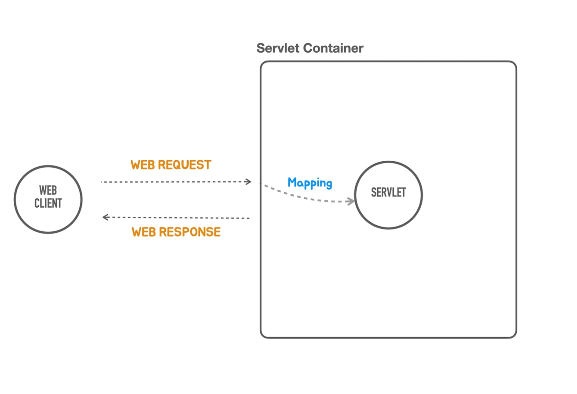
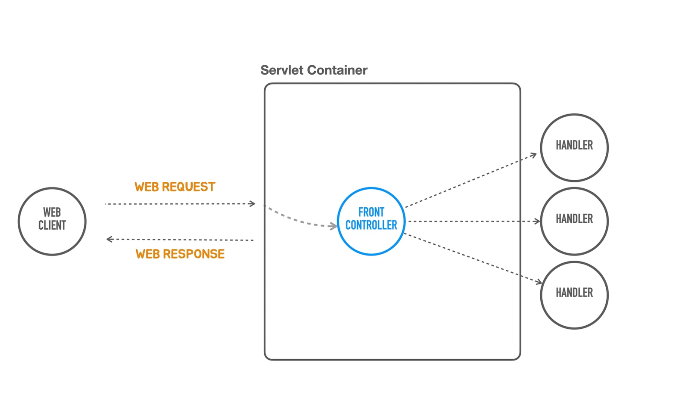

### 서블릿 컨테이너는 서블릿에 직접 매핑을 해야한다.

- 그럼 서블릿만 가지고 웹개발 다 되는것 아닌가 ?
- 그런데, 서블릿 컨테이너는 하나의 서블릿이 아니라 여러개의 서블릿을 가지고 있을텐데 "중복" 코드가 없을까 ... ?
- 비슷한 코드가 100 개라면 100 군데에서 나타나게 되는것.

### 프론트 컨트롤러
- 이를 개선 하기 위한 첫번째 시도

- 바로 프론트 컨트롤러의 등-장!
- 원래는 서블릿은 각 URL 에 맞게 mapping 을 해서 각기 다른 서블릿이 다른 URL 을 맡아서 처리하는 방식으로 동작해야 하는데
- 모든 서블릿에 공통적으로 등장하는 공통적인 코드를 중앙 에서 처리하고 그다음 요청의 종류에 따라서 전달하는 방식이다.
