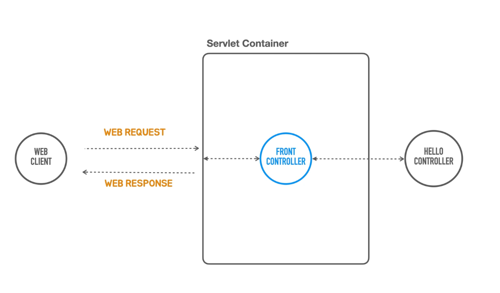
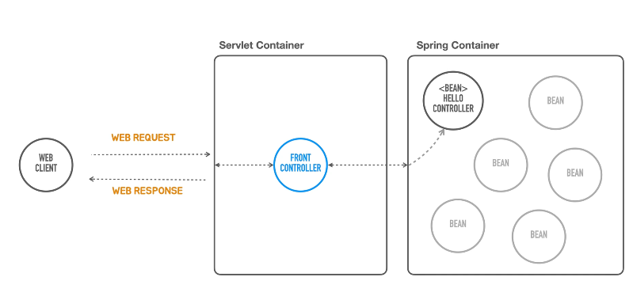
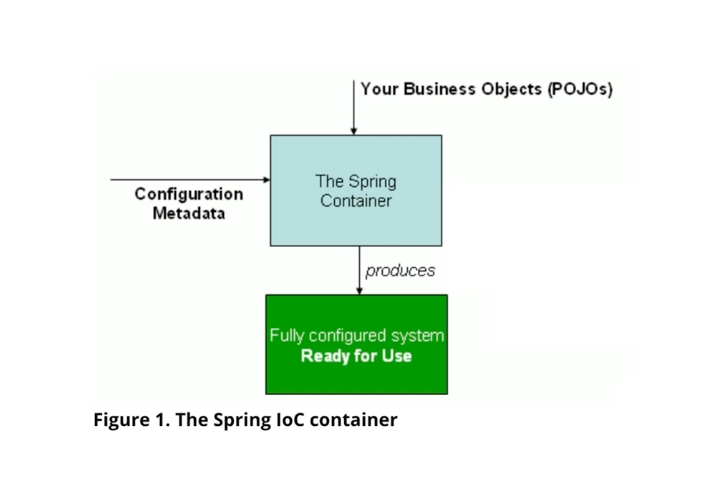
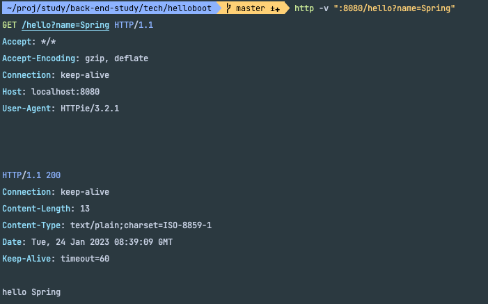

### 지금까지는 독립 실행이 가능한 서블릿 컨테이너를 만들어보았었다.



- 서블릿 컨테이너를 코드에서 띄웠고
- 서블릿을 모든 요청을 미리 받아서 뒤에 있는 Object 에게 적절히 매핑해서 작업을 위임 하였고 필요하다면 파라미터를 바인딩해서 전달하는 controller 를 만들었다.
```java

public class HellobootApplication {

    public static void main(String[] args) {
        TomcatServletWebServerFactory serverFactory = new TomcatServletWebServerFactory();

        WebServer webServer = serverFactory.getWebServer(servletContext -> {
            final HelloController helloController = new HelloController();

            servletContext.addServlet("frontcontroller", new HttpServlet() {
                @Override
                protected void service(final HttpServletRequest req, final HttpServletResponse resp) throws ServletException, IOException {
                    // 인증, 보안, 다국어, 공통 기능 한다고 가정
                    if (req.getRequestURI().equals("/hello") && req.getMethod().equals(HttpMethod.GET.name())) {

                        String name = req.getParameter("name");

                        String hello = helloController.hello(name);

                        resp.setStatus(HttpStatus.OK.value()); // 상태코드 인데 200은 생략이 가능하다 ! -> 서블릿 컨테이너가 에러가 나지 않는한 200 번 상태로드를 기본적으로 제공해 준다
                        resp.setHeader(HttpHeaders.CONTENT_TYPE, MediaType.TEXT_PLAIN_VALUE); // Header
                        resp.getWriter().println(hello); // body
                    } else if (req.getRequestURI().equals("/user")) {
                        //
                    } else {
                        resp.setStatus(HttpStatus.NOT_FOUND.value());
                    }
                }
            }).addMapping("/*");
        });
        webServer.start();
    }
}
```

### 이제는 Spring Controller 를 spring Container 안에 집어 넣어 보자



- 컨테이너는 이제 2개가 된것이다.
- 하나는 서블릿 컨테이너가, 또다른 하나는 spring container 이렇게 두개.
- 프론트 컨트롤러가 직접 hello controller Object 를 생성하고 변수에 담아뒀다가 사용하는 대신 스프링 컨테이너를 이용하는 방식으로 변경해보자.
- 컨테이너라 함은 여러개의 Object 를 가지고 있다가. 필요할때 사용되어지도록 관리를 하는것인데, 지금 구조는 servlet Container 안에 있는 Front Controller 를 우리가 직접 생성해서 servlet container 에다가 직접 집어넣어줬다.
- spring container 는 동작하는 방식이 조금 다르다

### spring container 가 동작하는 방식



- 스프링 컨테이너는 크게 두가지가 필요하다
- 첫번째는 비즈니스를 담고있는 비즈니스 Object ! -> POJO 라고 하는 평범한 Java Object ! ( 어떤 특정 클래스를 상속하거나 하는 방향이 아닌 퓨어한 자바 Object ) 우리가 만든 애플리케이션 코드에 대해서 말하는것이다.
- 두번째는 이렇게 만들어진 코드를 어떻게 구성할지에 대한 구성정보를 담고 있는 Configuration metadata 이다.
- 2가지를 스프링 컨테이너가 조합을 하고
- 사용가능한 "시스템" 을 만드는것이다.

> 요약: 스프링 컨테이너를 우리가 비즈니스에 필요한 코드와 구성정보를 담고있는 메타데이터를 조합해서 내부에 Bean 이라고 불리우는 Object 들을 구성해서 서버 애플리케이션으로 만들어 주는것이다.


1. spring Container 를 만들고
2. 거기에 helloController 를 집어넣고
3. 직접 사용하는 대신에 spring Container 한테 요청을 해서 사용 하는 방식


### Spring Container
- spring container 를 대표하는 interface 가 있다.
- 그게 applicationContext 인데, 이친구는 application 을 구성하고 있는 많은 정보, 어떤 Bean 이 들어갈 것인가 부터 시작해서 리소스에 접근하는 방법, 내부에 이벤트를 전달, 구독하는 방법 등등 이러한 object 들을,
구현해야 되는것이 스프링의 application context 이다.
- application context 가 결국은 spring container 가 되는것이다.
- application context 중에서, 코드에 의해 손쉽게 만들어 질수 있게 해주는것 이 있는데 이게 GenericApplicationContext 다.

### 구현
```java
public class HellobootApplication {

    public static void main(String[] args) {

        GenericApplicationContext applicationContext = new GenericApplicationContext();
        applicationContext.registerBean(HelloController.class); // bean 등록
        applicationContext.refresh(); // bean object 를 만들어준다

        TomcatServletWebServerFactory serverFactory = new TomcatServletWebServerFactory();

        WebServer webServer = serverFactory.getWebServer(servletContext -> {

            servletContext.addServlet("frontcontroller", new HttpServlet() {
                @Override
                protected void service(final HttpServletRequest req, final HttpServletResponse resp) throws ServletException, IOException {
                    // 인증, 보안, 다국어, 공통 기능 한다고 가정
                    if (req.getRequestURI().equals("/hello") && req.getMethod().equals(HttpMethod.GET.name())) {

                        String name = req.getParameter("name");

                        HelloController helloController = applicationContext.getBean(HelloController.class);
                        String hello = helloController.hello(name);

                        resp.setContentType(MediaType.TEXT_PLAIN_VALUE);
                        resp.getWriter().println(hello); // body
                    } else {
                        resp.setStatus(HttpStatus.NOT_FOUND.value());
                    }
                }
            }).addMapping("/*");
        });
        webServer.start();
    }
}
```

### 결과

- 기존에 동일한 동작이 수행되는 것을 볼 수 있다. 



