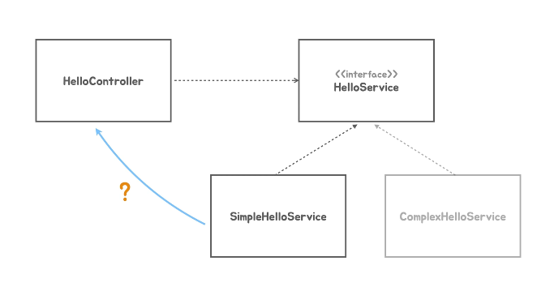

### 지금까지는 

- spring container 를 코드로 생성을 했었다.
- 그리고 스프링 컨테이너 에게 어떤 Object 를 만드는데 필요한 정보를 전달 해주고 컨테이너가 초기화 될때 그정보를 이용해서 Object 를 만들게 두었다.
- 스프링 컨테이너 를 통해서 컨테이너 가 가지고 있는 Object 를 getBean 이라는 메소드를 이용해서 이걸 사용하는 방식으로 전환을 했었다.
- 이렇게 만들면, FrontController 가 직접 new 키워드를 사용해서 Object 를 만들어서 사용하는것과 뭐가 다를까 ? 
  - 스프링 컨테이너 가 앞에 하나 더 붙은것 ( 쬐금더 복잡 ? ) 해진것 밖에 없다 ?
  - 여러가지 중요한 스프링 Container 가 할 수 있는 일들을 이후에 계속 적용 가능한 기본 구조를 짜 놓았다는게 의미가 있다.
  - 스프링 컨테이너는 기본적으로 이 안에 어떤 Object 를 만들때 딱 한번만 만든다. -> 싱글톤 패턴 ( 애플리케이션에서 딱 하나의 Object 를 만들어 두고 재사용하게 만드는 방식 )
  - 스프링 컨테이너는 어떤 타입의 Object 를 딱 한번만 만들어 두고 이걸 계속 재사용 할수있게 해주는 기능을 제공한다.
    - 스프링 컨테이너를 싱글톤 registry 라고 부른다. -> 싱글톤 패턴을 사용하지 않고도 마치 싱글톤 패턴을 쓰는것처럼 한번 만들어놨던것을 재사용 하는것

### 역할에 따라서 요청을 위임하는 방식으로

### 그전에 Dependency Injection 에 대하여

- 이 둘의 의존관계 (기능이 바뀌거나 메소드의 이름이 바뀌면 영향을 미친다 )
- Hello Controller 가 뭔가 다른 Object 의 기능을 사용하게 되면 해당 클래스에 의존하고 있는 관계

### 문제가 뭘까 ?

- HelloController 가 SimpleHelloService 가 아닌, SimpleHelloService 로 고치게 되면
- 다시 컴파일 하고 변경에 의한 배포를 해야한다.
- 이런 문제을 해결하기 위한 법칙이 있다

- HelloController 는 HelloService 에만 의존 관계를 가지고 있다.
- 그리고 이 인터페이스 를 구현한 클래스들 을 구현한다.
- 이렇게 만들어 두면 HelloController 는 HelloService 를 구현한 클래스를 아무리 많이 만들어도, HelloController 코드를 고치지 않아도 된다.

### 해결된게 아니라
- 소스코드상으론 해결이 된것 같아 보여도, 실제 런타임이 되면, HelloController 는 HelloService 인터페이스를 구현한 어떠한 클래스의 Object 를 이용해야한다.
- 그때는 어떤 Object 를 사용할것인가 결정이 되어있어야 한다.

- SimpleHelloService 를 이용하기로 했다.
- 그러면, 이 HelloController 는 어떤 클래스로 만들어진 Object 의 메소드를 이용하는건지 소스코드 상으론 알 수가 없다. (인터페이스만 이용한다 했으니까.)
- 어떻게든 이 둘 사이에 연관관계를 만들어 줘야 하는데 이게 Dependency Injection 이다.

### dependency Injection 에는 제 3의 존재가 필요하다.
- 우리는 이것을 Assembler 라고 한다.

- HelloController 는 HelloService 를 구현한 어떠한 클래스에 의존하는데 소스코드 레벨에선 의존하고 싶지 않다.
- SimpleHelloService 에서 ComplexHelloService 로 바꿨다고 해서 소스코드를 고치고 싶지는 않다는것.
- 그러나 런타임 시점에 필요로 하다면, simpleHelloService Object 대신 complexHelloService Object 로 사용하겠다는 작업이 필요하다. 
- 누군가는 이를 가능하도록 만들어 줘야 하는데, 그게 어떻게 가능해지냐면, HelloController 가 new 키워드를 사용해서 만드는 대신에, 
- 외부에서 그 Object 를 사용할 수 있도록 (런타임 시점에 결정된 Object 를 new 해줌) 주입을 해주는것이다.
- 이작업을 Assembler 라고 한다 이 친구가 Object 들을 가져다가 하나의 커다란 레고를 만드는 것 처럼, 원래는 직접 의존관계가 없는 클래스들의 Object 를 가져다가 서로 관계를 연결시켜주고 사용할 수 있도록 만들어 주는 역할을 한다.
- 이 Assembler 를 Spring Container 라고 한다.

### 스프링 컨테이너가 하는 역할
- 우리가 메타 정보를 주면, 그걸 가지고 클래스에 싱글톤 Object 를 만든다.
- 이 Object 를 사용하는데 의존성이 걸려있다면, 알아서 주입해 주는 작업까지 수행을 해준다.

### 왜 spring Container 는 메타 정보만 받아서, 직접 object 를 생성할까 ?
- HelloController 를 만들고나서 SimpleHelloService 를 사용하기로 했다면 SimpleHelloService 도 스프링 컨테이너가 관리하는 Bean 으로 등록하고, 주입을 해준다 라는것
- 주입은 뭐냐면, simpleHelloService Object 레퍼러 를 넘겨주는것이다. 

### 어디서 넘겨줄까 ?
- 첫번째 방법은
  - HelloController 를 만들때, 생성자 Parameter 로 SimpleHelloService Object 를 집어 넣어주는것이다.
  - 이때의 Parameter 의 Type 은 이 클래스가 구현하고있는 HelloService 라는 Interface Type 으로 되어있다.
  - 어찌됬건 생성자 를 통해서 주입 해주는 방식이 있고
- 두번째 방법은
  - FactoryMethod 로 Bean 을 만들게 해서 파라미터로 넘기는 방법
- 세번째 방법은
  - HelloController 클래스 에 프로퍼티를 정의해서 Setter method 를 통해 컨트롤러가 사용해야될 SimpleHelloService 를 주입해주는 방법이 있다.
- 그밖에도 있지만, 이런 작업들을 스프링 컨테이너가 Object 를 만들고 주입해주는 이런류의 모든 작업을 수행해주는 컨테이너로써 동작을 하는것이다.

### 핵심
> 인터페이스를 중간에 두고 의존관계를 맺고 직접적인 코드레밸의 의존관계를 제거해 버리는것.