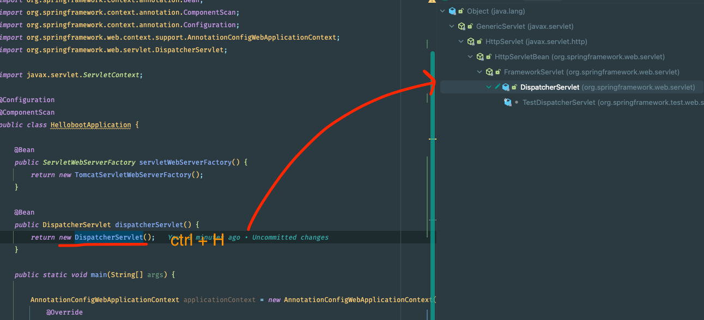
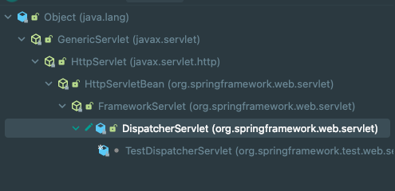
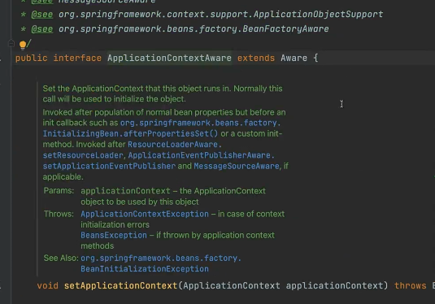
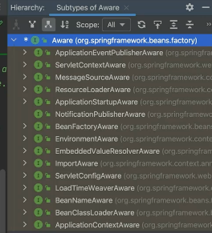

### 


### as is
```java
@Configuration
@ComponentScan
public class HellobootApplication {

    public static void main(String[] args) {

        AnnotationConfigWebApplicationContext applicationContext = new AnnotationConfigWebApplicationContext() {
            @Override
            protected void onRefresh() {
                super.onRefresh();

                TomcatServletWebServerFactory serverFactory = new TomcatServletWebServerFactory();
                WebServer webServer = serverFactory.getWebServer(servletContext -> {
                    servletContext.addServlet("dispatcherServlet",
                            new DispatcherServlet(this) // 어플리케이션 컨텍스트를 생성자를 통해 전달을 했다.
                    ).addMapping("/*");
                });
                webServer.start();

            }
        };

        applicationContext.register(HellobootApplication.class); // bean 등록
        applicationContext.refresh(); // bean object 를 만들어준다
    }
}
```

### to be
```java

@Configuration
@ComponentScan
public class HellobootApplication {

    @Bean
    public ServletWebServerFactory servletWebServerFactory() {
        return new TomcatServletWebServerFactory();
    }

    @Bean
    public DispatcherServlet dispatcherServlet() {
        return new DispatcherServlet();
    }

    public static void main(String[] args) {

        AnnotationConfigWebApplicationContext applicationContext = new AnnotationConfigWebApplicationContext() {
            @Override
            protected void onRefresh() {
                super.onRefresh();

                ServletWebServerFactory serverFactory = this.getBean(ServletWebServerFactory.class);
                DispatcherServlet dispatcherServlet = this.getBean(DispatcherServlet.class);

                // 스프링 컨테이너를 주입 ( 이전에는 생성자를 통해 주입했음 )
                // 지금은 factory method 를 통해 생성자 없이 생성을 해서 어플리케이션 컨텍스트를 this 로 넘길 수 없다.
                // 그리하여 dispatcherServlet 의 setApplicationContext 를 통해 컨텍스트 주입을 해준다.
                // 근데 사실 이친구 없어도 됨. spring Container 가 똑똑해서 dispatcherServlet 은 어플리케이션 컨텍스트가 필요하구나 ! 라고 알아서 주입을 해준다.
                dispatcherServlet.setApplicationContext(this); 
                
                WebServer webServer = serverFactory.getWebServer((ServletContext servletContext) -> {
                    servletContext.addServlet("dispatcherServlet", dispatcherServlet)
                            .addMapping("/*");
                });
                webServer.start();

            }
        };

        applicationContext.register(HellobootApplication.class); // bean 등록
        applicationContext.refresh(); // bean object 를 만들어준다
    }
}

```


### 위에 코드에 달아놓은 주석중에
- spring Container 가 똑똑해서 dispatcherServlet 은 어플리케이션 컨텍스트가 필요하구나 ! 라고 알아서 주입을 해준다.
- 이 부분은 어떻게 알아서 주입을 해주는지 궁금하다.
- 이걸 이해 할려면 빈의 lifecycle method 를 알아야 한다.
- 이해를 도모하기 위해 아래 이미지 처럼 DispatcherServlet 에 하이라키 구조를 보자



### 자세히 보면 DispatcherServlet 이 구현하고 있는 인터페이스 중에서 ApplicationContextAware 가 있다.


### ApplicationContextAware 를 구현해서 DispatcherServlet 을 만들었는데,
- 인터페이스를 들어가서 보면
- setApplicationContext 라는 메소드가 있다.
- applicationContext 를 param 으로 받아서 내부에 멤버 변수에다가 저장을 해주는 기능의 인터페이스 이다.
- spring 에 들어있는 인터페이스고, 빈을 컨테이너가 등록하고 관리하는 중에 컨테이너가 관리하는 Object 를 Bean 에다가 주입해주는 라이프싸이클 메소드다.


- 컴포넌트로 등록하던, 설정정보로 등록하던 아래와 같은 인터페이스를 구현 하면 스프링 컨테이너가 interface 의 setter 로 주입해줘야 되겠구로 ! 하고 주입한다.




