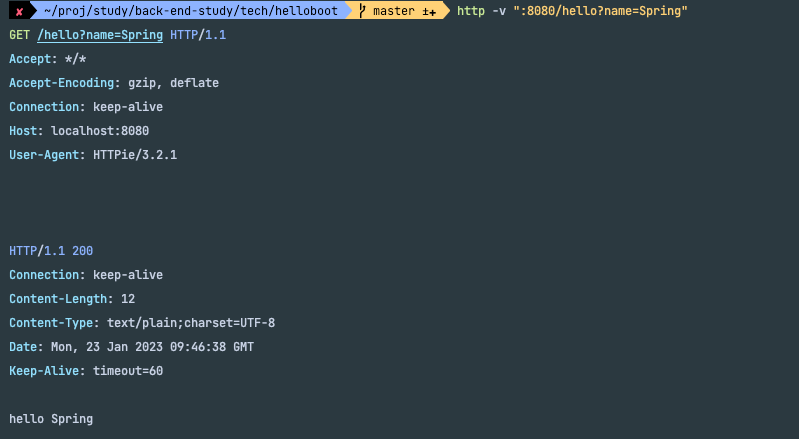

### Hello Api 테스트
- hello() 컨트롤러 메소드를 호출할 수 있는 HTTP Request 를 생성하고 리턴되는 HTTP Response 를 확인한다.

### HTTP 요청을 만들고 응답을 확인하는데 사용되는 도구
- 웹 브라우저 개발자 도구
- curl
- HTTPPie -> https://httpie.io/cli
- Intellij IDEA Ultimate - http request
- Postman API Platform
- Junit Test
- 등등

#### 토비님은 HttpPie 를 추천하셨으니 사용하도록 해보겠다.
- $ brew install httpie
- 간단한 명령어로 http 를 테스트 해볼수 있고 요청이 어떻게 날라가는지 확인 할 수 있다.
- http -v ":8080/hello?name=Spring"
  - ":" 콜론 앞을 생략하면, localhost 가 자동으로 붙는다.
  - 경로는 /hello
  
### 실제로 전달된 요청 

