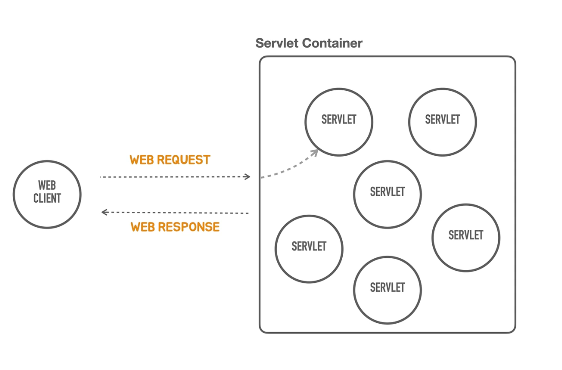
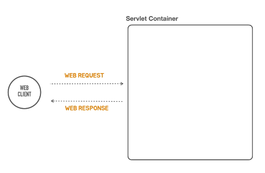
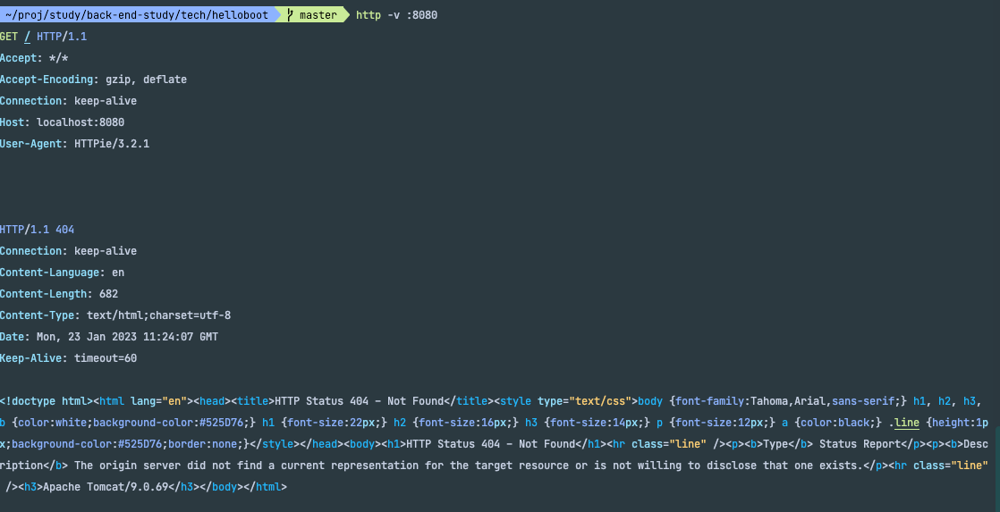

### 우리의 관심사

- 기존에는 @SpringBootApplication, SpringApplication.run 을 통해 ServletContainer 를 직접 구현하지 않아도 됬었다.
- 이 재료들이 없이 기존 /hello 컨트롤러의 요청과 응답을 똑같이 구현할 방법이 없을까 ?


- ServletContainer 를 설치하는 대신 stand alone 프로그램을 만들고,
- standalone 프로그램에서 servletContainer 를 알아서 띄워주는 작업을 할 것이다.



- servletContainer 란 자바의 표준기술이고 이를 구현한 제품들이 많이 나와있다. -> 톰캣
- 근데 사실 톰캣도 자바로 만들어졌다는 사실

```java
public class HellobootApplication {
    public static void main(String[] args) {
        // TomcatServletWebServer 를 만드는데 복잡한 생성과정과 복잡한 설정등을 지원하고, 모든 설정을 마친뒤에 tomcatServletWebserver 를 생성해 달라는 요청을 하면, 우아하게 만들어주는 일종의 도우미 클래스
        TomcatServletWebServerFactory serverFactory = new TomcatServletWebServerFactory();

        // servletContainer 를 만드는 함수 ( 이게 진짜 WebServer )
        WebServer webServer = serverFactory.getWebServer();
        
        // webServer 시작 ! 
        webServer.start();
    }
}
```

### 진짜 되는지 확인해보자

- 진짜 떳고 404 not found 를 확인.