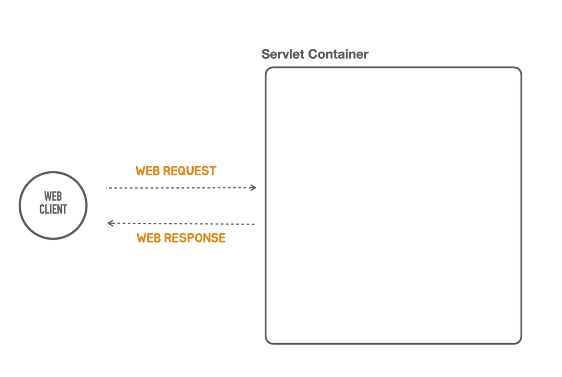
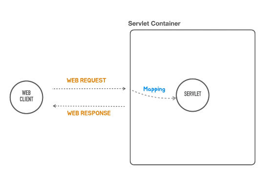
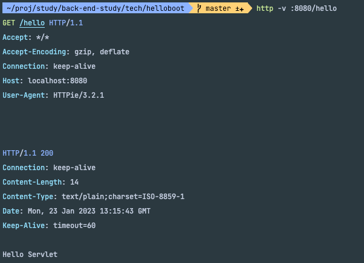

### 서블릿 컨테이너 까지 띄우는데 확인 하였다. (임베디드 톰캣을 이용해)


### 이번엔 기능을 수행하는 WebComponent ( Servlet ) 을 만들어 보자.


- servletContainer 는 원래 여러개의 Servlet 을 가질수 있다.
- servletContainer 가 특정 servlet 에게 어떠한 일을 맡길지 결정하는데 결정하는 작업을 mapping 이라고 한다.
- webClient 의 요청을 servletContainer 가 servlet 에게 요청을 넘겨주는것이다.
- 그러면 servlet 은 web 응답을 만들기 위해 필요로 하는 어떠한 작업들을 수행하고 작업을 종료한다.
- 이제 servletContainer 가 webClient 한테, 웹 응답 형태로 이를 돌려준다.

### 아주 난도질을 해놨는데, 
- 개인적으로는 주석으로 이해하고 따라가는데에 이만한게 없는것 같다.
- 지금 아래에서 무슨 지럴옘병을 하고있냐면, 
- servletFactory 를 new TomcatServletWebServerFactory(); 인스턴스 생성을 하였는데, 서블릿 컨테이너 팩토리를 만든것이다.
- 이 팩토리 인스턴스로 serverFactory.getWebServer() 함수를 열었는데 이부분이 webServer 를 띄우는 역할을 한다.
- 인자에 넣어줄 익명클래스로 들어가는 내용은 서블릿 컨테이너가 어떤 서블릿에게 적절한 일을 주는지에 대한 매핑 작업의 내용이다.
- servletContext.addServlet() <- 이친구는 두개의 인자를 받는데 서블릿 이름과, 작업 내용에 대한 내용을 받는다.
- void service() 는 두개의 인자를 받는데 바로 요청과 응답이다.
- 응답으로 주는 3가지 는 status (상태), Header, body 의 내용이며, 마지막으로 addMapping("/hello"); 매핑 해주는 작업이 이루어진다.
- "/hello" 요청이 오면 지금까지 작성했던 ServletContainer 가 Servlet 에 적당한 요청을 주고 마지막으로 매핑하는 작업까지 직접 만들어 보았다. (내가 만든건 아니고 토비님이 ^^)

```java
public class HellobootApplication {

    public static void main(String[] args) {
        // TomcatServletWebServer 를 만드는데 복잡한 생성과정과 복잡한 설정등을 지원하고, 모든 설정을 마친뒤에 tomcatServletWebserver 를 생성해 달라는 요청을 하면, 우아하게 만들어주는 일종의 도우미 클래스
        TomcatServletWebServerFactory serverFactory = new TomcatServletWebServerFactory();

        // servletContainer 를 만드는 함수 ( 이게 진짜 WebServer )
        WebServer webServer = serverFactory.getWebServer(servletContext -> {
            servletContext.addServlet("hello", new HttpServlet() {
                @Override
                protected void service(final HttpServletRequest req, final HttpServletResponse resp) throws ServletException, IOException {
                    resp.setStatus(200); // 상태코드
                    resp.setHeader("Content-Type", "text/plain"); // Header
                    resp.getWriter().println("Hello Servlet"); // body
                }
            }).addMapping("/hello"); // "/hello" 라는 요청이 오면 "new HttpServlet() {" <- 이친구가 처리를 하겠다 라는 구문이 되겠다.
        }); // getWebServer() 를 이용해 Servlet Container 에다가 Servlet 을 등록하는데 필요한 작업을 수행하는 Object 를 만들때 쓴다.
        webServer.start();
    }
}
```
