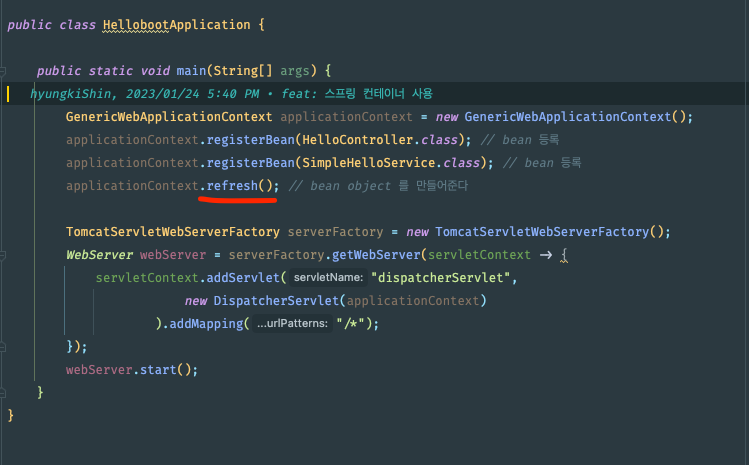
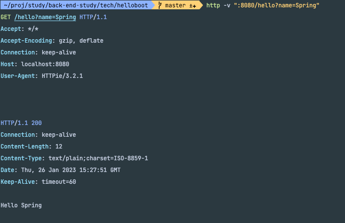

### 지금까지의 작업 2파트
- 앞부분에서, 스프링 컨테이너를 생성하고, 빈을 등록해서 초기화 해주는 스프링 컨테이너 작업 파트 
- 그렇게 만든 스프링 컨테이너를 활용하면서, 서블릿 컨테이너를 코드에서 생성하고 필요한 프론트 컨트롤러역할을 하는 디스패처 서블릿을 등록하는 서블릿 컨테이너 초기화 작업 파트

### 서블릿 컨테이너를 만들고 서블릿을 초기화 하는 등의 작업을 스프링 컨테이너가 초기화 하는 과정중에 일어나도록 변경
- 왜 그렇게 만드냐 -> 스프링 부트가 그렇게 만들기 때문에
- 적절한 타이밍에 만들었다고 본다.
- 어느 시점에 초기화 하는 작업이 필요할까 ? 

> 아래 refresh 부분에서 일어난다. 
> 
> 이 안에 코드를 살펴보면 전형적인 템플릿 메소드 패턴이다.
> 
>

- 템플릿 메서드를 패턴을 사용하면, 그안에 여러개의 hook 메서드를 주입하기도 한다.
- 일정한 순서에 의해 호출이 되는데 서브클래스에서 확장하는 방법을 통해 특정 시점에 어떤 작업을 수행하게 해서 기능을 유연하고 확장하게 만드는 기법이다.
- 그 hook method 이름이 refresh 이다.
- spring container 를 초기화 하는 작업 중에, 부가적으로 어떤 작업을 수행할 필요가 있다면 사용하라고 만들어 놓은게 있다.
- 템플릿 메소드 패턴은 상속을 통해 기능을 확장하라고 만들어 놓은것
- GenericWebApplicationContext() 를 상속해서 새로운 클래스를 하나 만들어야 한다.
- 간단하게 상속 또는 구현 해보자 -> 익명클래스 사용 

```java
public class HellobootApplication {

    public static void main(String[] args) {

        GenericWebApplicationContext applicationContext = new GenericWebApplicationContext() {
            @Override
            protected void onRefresh() {
                super.onRefresh();

                TomcatServletWebServerFactory serverFactory = new TomcatServletWebServerFactory();
                WebServer webServer = serverFactory.getWebServer(servletContext -> {
                    servletContext.addServlet("dispatcherServlet",
                            new DispatcherServlet(this)
                    ).addMapping("/*");
                });
                webServer.start();

            }
        };

        applicationContext.registerBean(HelloController.class); // bean 등록
        applicationContext.registerBean(SimpleHelloService.class); // bean 등록
        applicationContext.refresh(); // bean object 를 만들어준다
    }
}
```

