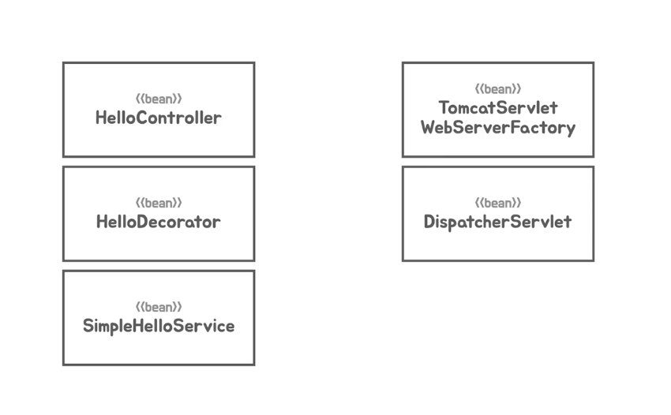
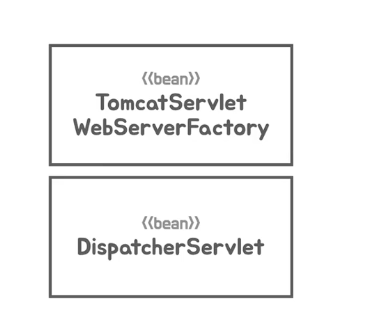
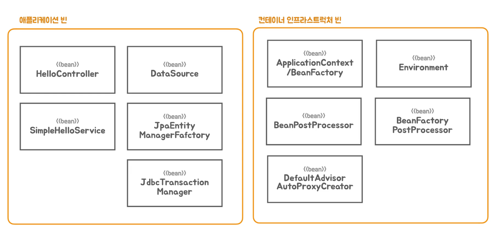
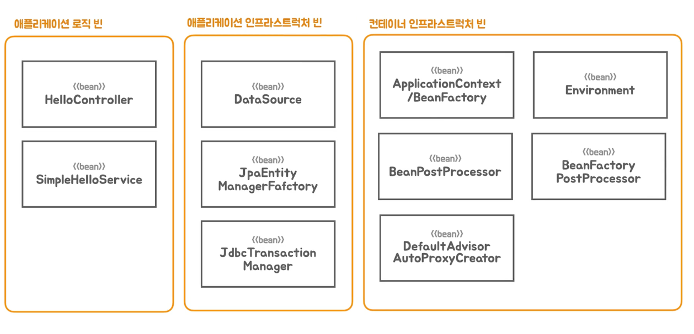
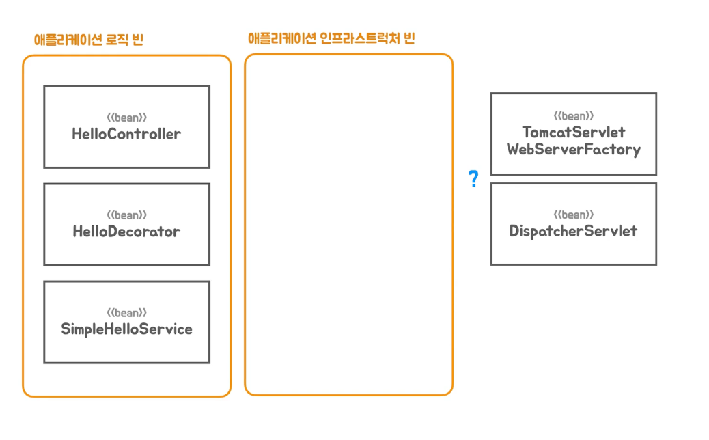
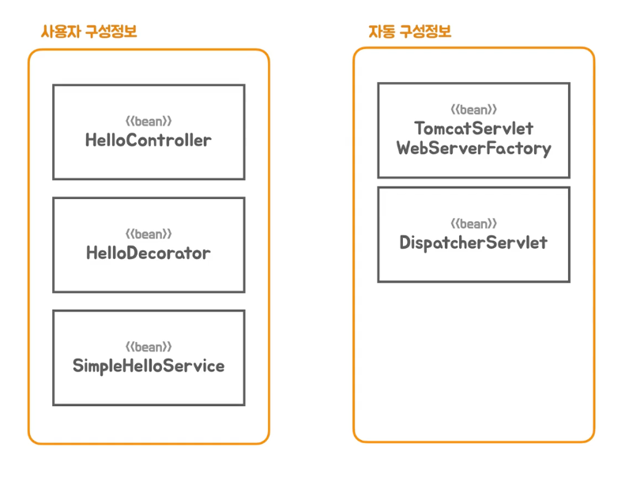
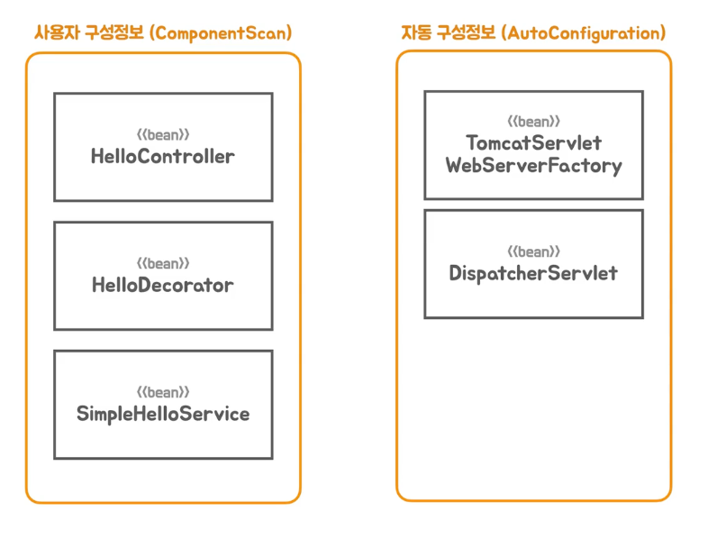
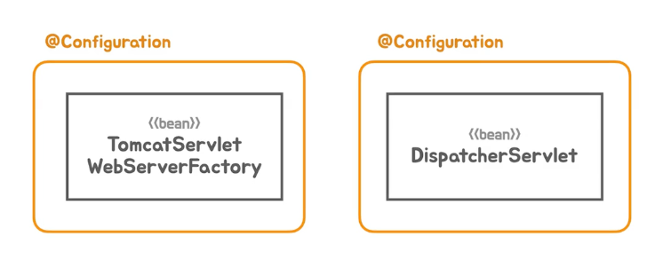

### 빈 오브젝트 와 역할, 구분
- 스프링 컨테이너에 등록되는 빈
  - 성격이 조금씩 다른것들이 등록되는것
  - 구성정보를 작성하는 방법 

### 스프링 부트가 컨테이너 less 를 지원하기 위해 등록된 2가지 BEAN

- 스프링 부트가 컨테이너 less 를 지원하기 위해 등록된 내장형 서블릿 컨테이너를 이용하는 
- 독립 실행형 애플리케이션 방식으로 동작을 하면서 요구된 2개의 빈이다.
- 어떤식으로 구분해서 구성정보를 어떤 전략으로 작성해볼것인가 ? 

### 크게 스프링 컨테이너가 관리하는 빈 

- 어플리케이션 빈 
  - 개발자가 어떤 빈을 사용할건지 구성정보를 제공함
- 컨테이너 인프라스트럭처 빈
  - 스프링컨테이너 자신이거나, 스프링 컨테이너가 계속 확장하면서 추가해온 것들을 빈으로 등록해서 사용
- 컨테이너는 자기 자신도 빈으로 등록할수 있도록 등록한다.
  - 외부설정과 같은 환경 정보에 접근하는 env 빈 도 있다.
- 컨테이너가 빈을 다루고 추가하는 작업중에 기능을 추가할 수 있는 방법들이 있는데,
  - 흔히 bean Post Process 도 빈으로 등록된다.

### 개발자가 등록하는 빈을 구분 할 수있다

- 에플리케이션 로직빈
  - 에플리케이션의 로직, 도메인 로직 을 담고 있는 코드들로 만들어진 빈
- 에플리케이션 인프라 스트럭처 빈
  - 대부분 기술과 관련된것 들
  - 대부분 우리가 작성하지 않는다.
  - 대신 특정 기술을 사용하겠다고 구성정보에 기술해 놓는것.

### 애플리케이션 인프라스트럭처 빈

- 원래 전통적인 스프링 애플리 케이션에서는 빈으로 등록해서 사용하지 않았다.
- dispatcher Servlet 은 필요하지만, 직접 컨테이너에게 서블릿으로 등록해서 써왔고,
- TomcatServlet WebServerFactory 는 서블릿 컨테이너를 따로 실행시켜 설치했었으니, 아예 빈으로 등록될 생각도 못했다.

### 스프링 부트의 개발자가 분류한다면 ?

### 어떤 방식으로 구성정보를 만드느냐 ?

### 자동 구성정보 는 어떤 방식으로 만들어 지는가

- 애플리케이션에서 사용될 수 있는 infrastructor Bean 을 담은 Configuration class 들을 만들어 놓는다.  (기능으로 구분 )
- 서블릿 컨테이너를 생성하는데 필요한. factory Bean 을 담고있는 Configuration class 를 .
- Spring Web 을 사용하는데 필요한. Dispatcher Servlet bean 을 생성하는 Configuration class 를 만들어 놓는다.
- 그리고 springboot 가 이중에서 필요한 Configuration class 들을 찾아서, 빈으로 등록한다. <- 자동 구성방식

